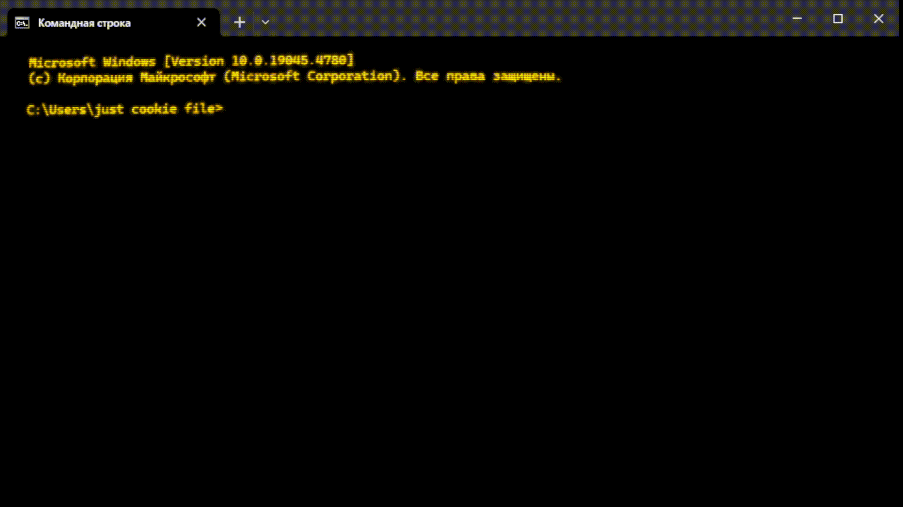

# CRT Shader Effect for Windows Terminal
---
This shader simulates a CRT (Cathode Ray Tube) screen effect by applying several post-processing techniques, including scanlines, lens distortion, and blur. It creates a retro, analog display effect, often associated with older television and computer screens.  


## Instructions for Installing Settings in Windows Terminal
---
1. **Open Windows Terminal**: If you don't already have Windows Terminal, you can download it from the [Microsoft Store](https://apps.microsoft.com/detail/9n0dx20hk701?hl=en-US&gl=US).

2. **Open Windows Terminal Settings**: In Windows Terminal, open settings by clicking the down arrow in the top pane and selecting ‘Settings’, or use the keyboard shortcut `Ctrl + ,`.

3. **Open JSON File with Settings**: In the left pane of the settings, select the ‘Open JSON file’ tab or go to manually edit the configuration file via the menu.

4. **Edit JSON File**: Add or update your configuration in the `profiles.json` file. Your JSON file should look something like this:
    ```json
    {
      "profiles": {
        "defaults": {},
        "list": [
          {
               "commandline": "%SystemRoot%\\System32\\cmd.exe",
               "guid": "{0caa0dad-35be-5f56-a8ff-afceeeaa6101}",
               "name": "CMD",
               "background": "#000000",
               "foreground": "#FFBF00",
               "cursorColor": "#FFBF00",
               "cursorShape": "vintage",
               "experimental.pixelShaderPath": "Patch_to_crt.hlsl (example: \"C:\\Users\\just cookie file\\crt.hlsl\")",
               "experimental.retroTerminalEffect": true,
               "hidden": false,
               "opacity": 100
          }
        ]
      }
    }
    ```
    - **commandline**: Path to the command line executable (default is `cmd.exe`).
    - **guid**: The unique identifier of the profile. You can leave it as is or generate a new one.
    - **name**: The name of the profile to be displayed in the list.
    - **background**: The background color of the terminal (black in this case).
    - **foreground**: Text color (amber).
    - **cursorColor**: Cursor color (amber).
    - **experimental.pixelShaderPath**: Path to the shader file (`crt.hlsl`) that will be applied to the terminal.
    - **experimental.retroTerminalEffect**: Boolean value enabling the retro-terminal effect. Set to `true` for activation and `false` for deactivation.
    - **hidden**: Specifies whether the profile will be hidden.
    - **opacity**: Transparency of the terminal (100 - completely opaque).

5. **Save Changes**: After you have made changes to the file, save it.

6. **Restart Terminal**: After saving the settings, restart Windows Terminal to apply the changes.

Your terminal should now use the `crt.hlsl` shader with the specified colors, effects, and other settings.

---

This version ensures a clear and easy-to-follow guide for users to set up the CRT shader effect in Windows Terminal.